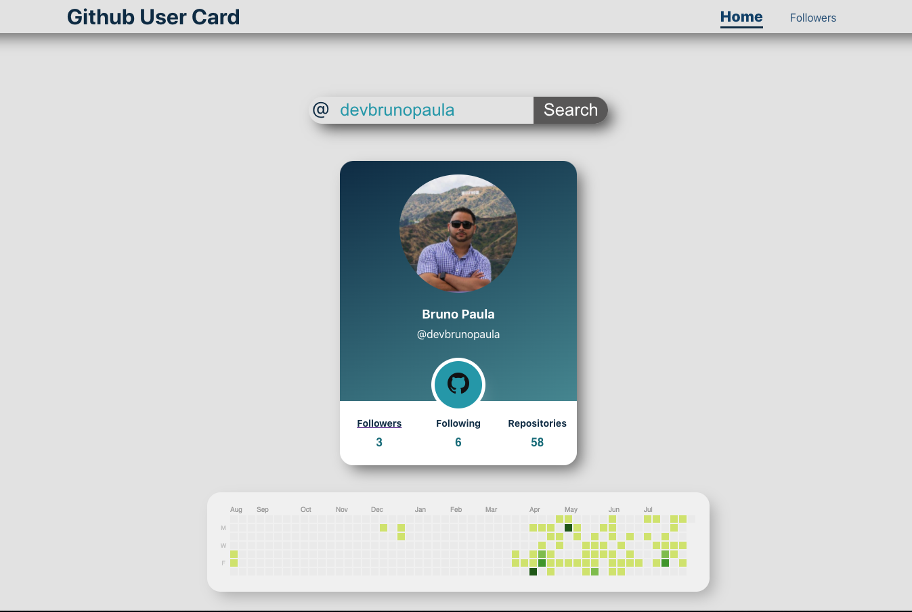

# Module Project: Component Lifecycle Methods - React Github User Card

This project allows you to practice the concepts and techniques learned in this module and apply them in a concrete project. This module explored lifecycle methods in class components. In your project you will demonstrate proficiency of these concepts by recreating the Github User Card project, but as a React application this time.

## Introduction

### Completed Project

